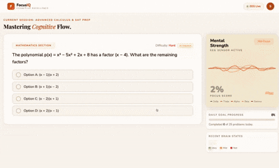
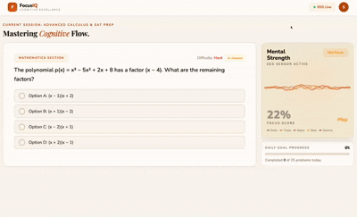

<div align="center">

# FocusIQ

**Real-time EEG-powered adaptive learning platform**

Built with React + Vite | Web Bluetooth API | Canvas API

---

</div>

## About

FocusIQ is a cognitive learning tool that connects to an EEG headset via Web Bluetooth to monitor your brain's focus levels in real time. It dynamically adapts question difficulty based on your mental state, provides intelligent hints when you're struggling, and enforces healthy study habits with break reminders.

## Features

### Adaptive Difficulty
Questions automatically scale in difficulty based on your EEG focus score. When your brain is locked in, the challenge ramps up. When focus dips, the system nudges you toward easier problems.

### Real-Time Brain State Detection
Three focus states are tracked continuously:
- **Very Focused** (25-60%) — Deep concentration detected
- **Mid Focus** (13-24%) — Moderate attention, hints and prompts begin
- **Not Focused** (0-12%) — Low engagement, lock-in alert triggered

### Lock-In Alert
When focus drops to "Not Focused", an undismissable alert appears and stays until your brain state improves — keeping you accountable.

<div align="center">

</div>

### Smart Hint System
After 15 seconds of mid focus, a contextual hint appears for the current question. After 30 seconds, a "Still Stuck?" prompt offers to switch to an easier question. After 45 seconds, a break is recommended.

<div align="center">

</div>

### 5-Band EEG Visualization
A live canvas-rendered waveform displays Delta, Theta, Alpha, Beta, and Gamma brainwave activity from the EEG sensor.

### Break Enforcement
When sustained low focus is detected, the app recommends a 5-minute break with a full-screen timer overlay to help your brain recover.

## Tech Stack

| Layer | Technology |
|-------|-----------|
| UI Framework | React |
| Build Tool | Vite |
| Styling | Inline CSS (no framework) |
| EEG Connection | Web Bluetooth API |
| Visualization | Canvas API |

## Getting Started

```bash
# Install dependencies
npm install

# Start dev server
npm run dev

# Build for production
npm run build
```

### Deploy on Netlify

- **Build command:** `npm run build`
- **Publish directory:** `dist`

## How It Works

1. Click **Connect EEG** to pair your Bluetooth EEG headset
2. The app reads focus percentage and 5-band brainwave data in real time
3. A rolling 5-reading average determines your brain state
4. Questions, hints, and alerts adapt automatically based on your state
5. Your daily goal progress and accuracy are tracked throughout the session

---

<div align="center">

**Built for LotusHack**

</div>
